# AI 文本转 PPT 微课视频平台 PRD

## 1. 文档信息

### 产品名称

Volcano AI 微课视频生成平台

### PRD版本

v1.0.6

### 创建时间

2026-06-13

### 状态

Draft

### 变更记录

| 版本 | 日期 | 变更说明 |
| -- | -- | -- |
| v1.0.0 | 2026-06-13 | 创建完整 PRD 初稿 |
| v1.0.1 | 2026-06-13 | 完成产品评审并补充修订项 |
| v1.0.2 | 2026-06-13 | 明确默认模型为 DeepSeek、用户并发生成数为 1、TTS 改为通用 Provider、第一版不做管理员后台 |
| v1.0.3 | 2026-06-13 | 补充免费输入字数 3000-5000、MiniMax TTS 时间戳能力、管理员来源说明 |
| v1.0.4 | 2026-06-13 | 明确管理员来源采用环境变量邮箱白名单 |
| v1.0.5 | 2026-06-13 | 明确免费额度每日刷新、首个正式 TTS 为 MiniMax、R2 删除后不保留 |
| v1.0.6 | 2026-06-13 | 明确 Remotion 作为项目内视频模板与动效引擎集成，渲染执行由 Worker 承载 |

---

## 2. 项目背景（Background）

### 当前问题

学生和老师在使用 AI 工具时，经常获得一段逻辑较完整但表达形式单一的长文本回答。该类文本通常适合阅读，不适合直接教学传播：缺少页面结构、重点高亮、可视化图示、节奏控制、旁白音频、字幕和视频化表达。老师若希望将 AI 回答做成微课，需要手动整理脚本、制作 PPT、录音、剪辑和导出视频，流程长且门槛高。

当前市场上的文本转视频工具多偏营销短视频或素材拼接，难以满足教学场景的结构化解释、知识点拆解和稳定课件风格需求。

### 用户痛点

- 学生：AI 回答过长，阅读负担高，抽象知识缺少图示辅助，难以快速理解重点。
- 老师：制作微课成本高，需要在 AI、PPT、录音、剪辑工具之间来回切换。
- 老师：已有 AI 回答不能直接复用为课堂视频，二次加工耗时。
- 学生和老师：普通 TTS 朗读缺少画面配合，难以形成有效学习体验。
- 老师：不同知识点需要不同可视化表达，如流程、对比、时间线、概念卡片，手工制作难度高。
- 学生和老师：生成过程不可控时，容易出现文案冗长、音画不同步、字幕错位、视频节奏拖沓。

### 业务痛点

- AI 教学内容从文本到视频的转化链路缺少标准化工具。
- 教育用户对高质量微课内容有稳定需求，但传统制作方式无法规模化。
- 视频生成涉及 LLM、TTS、渲染和存储成本，若无任务状态机和额度控制，业务成本不可控。
- 缺少结构化分镜协议会导致后续编辑器、模板扩展、渲染器切换和内容审核难以扩展。

### 为什么要做

本项目希望提供一个面向学生和老师的 AI 微课视频生成平台。第一版聚焦“AI 回答转 PPT 微课视频”，通过结构化分镜、逐镜头 TTS、时间轴计算和 Remotion 渲染，实现自动生成完整 MP4 视频。平台优先保证稳定性、可解释性、可扩展性，而不是追求任意生成复杂动画。

---

## 3. 项目目标（Goals）

### 用户目标

- 老师可在 3 分钟内提交一段 AI 回答并启动微课视频生成。
- 学生可将难懂的 AI 回答转为可观看的短视频解释。
- 用户无需使用 PPT、录音和剪辑软件即可获得完整 MP4 微课视频。
- 用户可查看生成进度、分镜预览、视频结果和失败原因。

### 业务目标

- 建立 AI 教学视频生成的核心闭环。
- 沉淀结构化 Storyboard 数据，为后续分镜编辑、模板市场、数字人讲解和多渲染器扩展打基础。
- 建立成本可控的异步生成链路，支持按用户、项目和任务统计资源消耗。
- 验证老师和学生对“AI 回答转微课”的真实使用意愿。

### 技术目标

- 使用 Next.js 全栈平台承载 UI 和 tRPC API。
- 使用 better-auth 完成认证接入。
- 使用 Prisma + PostgreSQL 管理业务数据。
- 使用 Inngest 编排长任务和失败重试。
- 使用 Cloudflare R2 存储音频、字幕、分镜 JSON、缩略图和视频。
- 在项目内集成 Remotion，作为 PPT 微课视频模板、视觉效果和动效实现引擎；渲染执行由独立 Worker 进程/服务承载。
- 默认大模型使用 DeepSeek，并通过 OpenAI-compatible LLM Provider 接入。
- TTS 使用通用 Provider 抽象，第一版不绑定固定厂商，允许接入任意满足质量和接口契约的 TTS 服务。
- 抽象 LLM Provider、TTS Provider、Storage Provider 和 Render Provider。
- 从第一天建立 Storyboard JSON、Job 状态机、Asset 存储模型。

### 成功指标（KPI）

- 首次生成成功率 >= 85%。
- 生成任务可恢复率 >= 95%，即重试后无需从头重做全部步骤。
- 3 分钟以内视频的端到端生成耗时 P75 <= 8 分钟。
- TTS 音频与画面时长错位投诉率 <= 2%。
- 用户完成“输入文本到获得视频”的转化率 >= 40%。
- 用户生成后 7 日内复用率 >= 20%。
- 生成失败任务中，明确错误原因展示覆盖率 >= 95%。

---

## 4. 用户分析（User Analysis）

### 目标用户

- 中小学和高校老师。
- 学生和自学者。
- 教研人员。
- 【待确认】是否包含企业培训人员。建议 A：MVP 不纳入；建议 B：以教育培训身份纳入；建议 C：独立做企业版。

### 用户画像

| 用户类型 | 特征 | 核心需求 | 使用频率 |
| -- | -- | -- | -- |
| 老师 | 有课程内容生产需求，熟悉 PPT，但不一定会剪辑 | 快速把 AI 回答转成课堂微课 | 每周多次 |
| 学生 | 使用 AI 辅助学习，希望把抽象内容讲明白 | 把难懂文本变成可视化解释 | 按学习场景触发 |
| 教研人员 | 负责课程素材整理和教学资源建设 | 批量生成统一风格微课 | 项目制使用 |

### 用户场景

- 老师让 AI 解释“光合作用”，复制回答后生成 3 分钟课堂导入视频。
- 学生把 AI 对“Transformer 自注意力机制”的回答转成可视化微课。
- 老师将 AI 生成的历史知识点总结转成课前预习视频。
- 教研人员批量生成统一模板的知识点短视频。

### 用户旅程（User Journey）

| 阶段 | 用户行为 | 用户目标 | 痛点 |
| -- | ---- | ---- | -- |
| 获取文本 | 在 AI 工具中提问并复制回答 | 拿到逻辑完整的解释文本 | 文本长且难以直接教学使用 |
| 创建项目 | 进入平台，粘贴 AI 回答，选择目标对象、时长、比例和语音 | 快速启动生成 | 参数过多会增加决策负担 |
| 等待生成 | 查看生成进度 | 知道系统在做什么、还需多久 | 长任务不透明会导致焦虑 |
| 查看分镜 | 查看自动生成的 PPT 分镜 | 判断内容是否基本可用 | 第一版暂不编辑可能影响控制感 |
| 查看视频 | 播放视频并下载 MP4 | 获得可发布或课堂使用的视频 | 音画不同步、字幕错位会影响信任 |
| 失败处理 | 查看失败原因并重试 | 尽快恢复任务 | 若从头生成会浪费成本和时间 |

---

## 5. 功能范围（Scope）

### In Scope

- 用户登录态下创建视频项目。
- 粘贴 AI 回答文本作为输入。
- 选择目标用户、难度、视频比例、目标时长、语音。
- 使用 LLM 生成结构化 Storyboard JSON。
- 校验和修复 Storyboard JSON。
- 每个 scene 单独调用可插拔 TTS Provider 生成高质量音频，第一版不绑定固定 TTS 厂商。
- 获取或计算每段音频 durationMs。
- 根据音频时长生成 timeline。
- 使用项目内 Remotion 模板与动效代码渲染 MP4，渲染执行在独立 Worker 中完成。
- 上传音频、字幕、分镜 JSON、缩略图、MP4 到 Cloudflare R2。
- 使用 Inngest 编排任务、重试和阶段状态。
- 默认使用 DeepSeek 生成 Storyboard。
- 同一用户同一时间只允许 1 个视频生成任务处于运行态。
- 使用 tRPC + TanStack Query 查询和变更数据。
- 使用 Zustand 管理局部 UI 状态。
- 项目列表、创建页、生成进度页、分镜预览页、视频结果页。
- 句子级字幕。
- 基础用量记录和每日免费额度限制，免费额度每日刷新一次。
- 失败原因展示、重试、取消。

### Out of Scope

- 分镜手动编辑。
- Figma 式高级编辑器。
- HyperFrames 渲染器。
- 数字人讲解。
- 自动生成复杂 3D 动画。
- 视频素材库和图片生成。
- 多人协作、班级管理。
- 在线支付和完整商业计费。
- 批量导入生成。
- 多语言视频生成。
- 逐字级字幕高亮。
- PPTX 导出。
- 管理员后台页面。

---

## 6. 功能架构图（Feature Architecture）

```text
Volcano AI 微课视频生成平台
├── 用户与权限
│   ├── better-auth 登录态接入
│   ├── 用户项目权限
│   └── 管理员查看权限
├── 项目管理
│   ├── 创建项目
│   ├── 项目列表
│   ├── 项目详情
│   ├── 项目删除
│   └── 项目状态展示
├── 视频生成
│   ├── 输入文本校验
│   ├── 参数配置
│   ├── LLM 分镜生成
│   ├── Storyboard Schema 校验
│   ├── Storyboard 修复
│   ├── TTS 音频生成
│   ├── 字幕生成
│   ├── 时间轴计算
│   ├── Remotion 模板与动效
│   ├── Remotion 渲染执行
│   └── 结果归档
├── 资源管理
│   ├── R2 上传
│   ├── 签名下载 URL
│   ├── Asset 元数据
│   ├── 文件删除
│   └── 文件复用
├── 任务系统
│   ├── Inngest 事件触发
│   ├── Job 状态机
│   ├── 幂等键
│   ├── 失败重试
│   └── 取消任务
├── 前端体验
│   ├── Dashboard
│   ├── Create
│   ├── Progress
│   ├── Storyboard Preview
│   └── Video Result
├── Provider 抽象
│   ├── LLM Provider
│   ├── TTS Provider
│   ├── Storage Provider
│   └── Render Provider
└── 运营与观测
    ├── 用量记录
    ├── 错误日志
    ├── 生成日志
    ├── 埋点
    └── 审计日志
```

---

## 7. 核心业务流程（Business Flow）

### 主流程

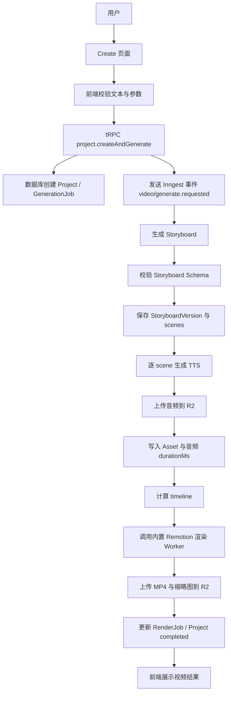

### 异常流程

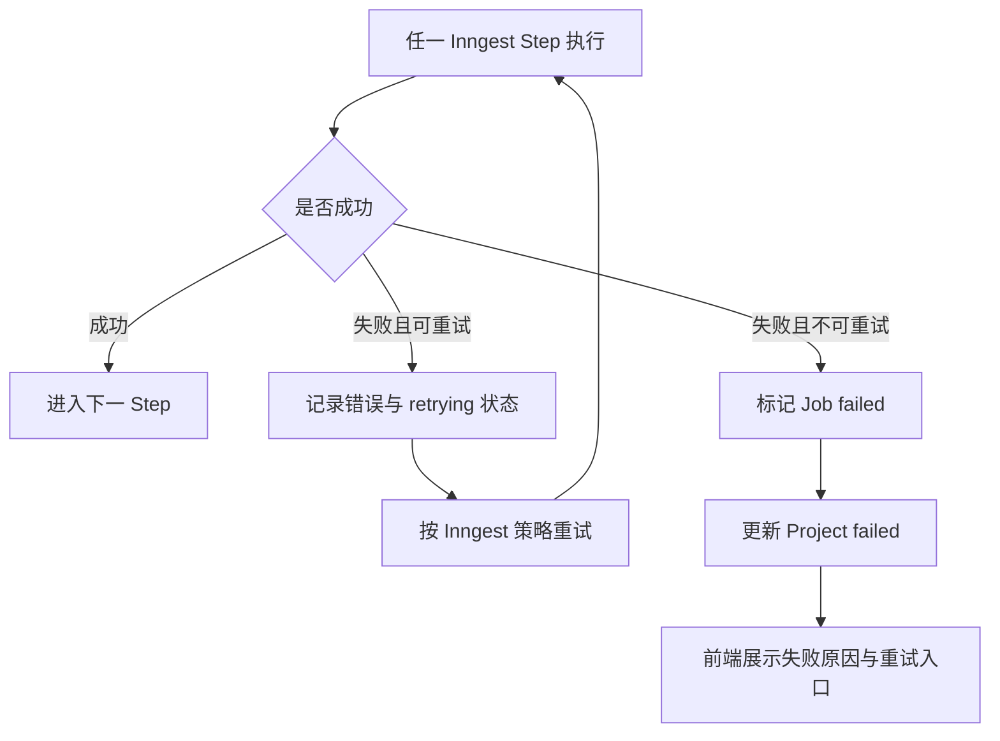

### 回滚流程

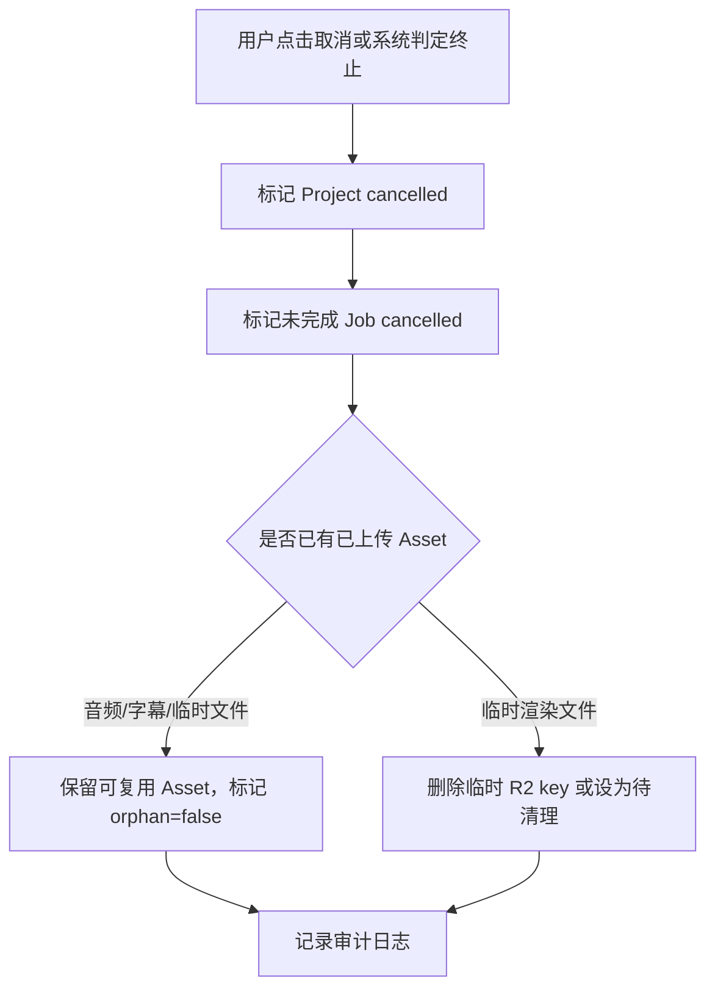

---

## 8. 页面设计

### 页面名称：Dashboard 项目列表

#### 页面目标

展示用户创建过的视频项目，支持快速创建、查看状态、进入详情、删除项目。

#### 页面元素

- 顶部导航：产品名、用户头像、退出入口。
- 主操作按钮：创建新微课。
- 项目列表：标题、状态、缩略图、创建时间、视频时长、目标人群、失败原因摘要。
- 筛选项：全部、生成中、已完成、失败。
- 分页或无限加载。

#### 交互行为

- 点击创建新微课进入 `/create`。
- 点击项目卡片进入 `/projects/[id]`。
- 点击失败项目的“重试”触发 retry。
- 点击删除弹出确认框。

#### 状态

- Loading：展示列表骨架屏。
- Empty：展示空状态和创建按钮。
- Success：展示项目列表。
- Error：展示错误提示和刷新按钮。

#### 权限控制

- 游客不可访问，跳转登录。
- 用户仅可查看自己的项目。
- 第一版不做管理员后台页面；管理员能力仅保留为服务端权限判断、日志排查和后续后台扩展入口。

#### 埋点需求

- `dashboard_view`
- `project_card_click`
- `project_filter_change`
- `project_delete_click`
- `project_retry_click`

### 页面名称：Create 创建视频

#### 页面目标

让用户粘贴 AI 回答并配置生成参数，启动自动视频生成。

#### 页面元素

- 文本输入框：支持粘贴 AI 回答。
- 字数统计：当前字数、最大字数。
- 目标对象：学生、老师。
- 难度/年级：【待确认】选项列表。建议 A：小学/初中/高中/大学/通用；建议 B：简单/标准/进阶；建议 C：二者都保留。
- 视频比例：16:9、9:16、1:1。
- 目标时长：1 分钟、3 分钟、5 分钟。
- 语音选择：来自当前启用 TTS Provider 的 voiceId 列表。
- 生成按钮。

#### 交互行为

- 输入为空时生成按钮禁用。
- 超过最大字数时禁止提交并提示。
- 提交后创建项目并跳转进度页。
- 提交过程中按钮 loading，禁止重复点击。

#### 状态

- Loading：提交中。
- Empty：默认表单。
- Success：提交成功后跳转。
- Error：显示表单错误或接口错误。

#### 权限控制

- 游客不可提交。
- 用户需满足每日额度。
- 管理员不受普通用户额度限制，仅用于内部测试和故障排查。

#### 埋点需求

- `create_page_view`
- `source_text_paste`
- `generation_config_change`
- `generate_submit`
- `generate_submit_failed`

### 页面名称：Project Progress 生成进度

#### 页面目标

展示异步生成进度，降低等待焦虑，允许取消和失败重试。

#### 页面元素

- 项目标题。
- 阶段进度条：分析文本、生成分镜、生成语音、计算时间轴、渲染视频、完成。
- 当前步骤文案。
- 已生成分镜预览区域。
- 错误提示区。
- 取消按钮。

#### 交互行为

- 前端通过 TanStack Query 轮询状态，每 2-5 秒一次。
- 状态 completed 后跳转或显示视频结果入口。
- 状态 failed 后展示失败原因和重试按钮。
- 点击取消需二次确认。

#### 状态

- Loading：项目详情加载中。
- Empty：项目不存在或无权限。
- Success：展示当前进度。
- Error：查询失败时展示刷新按钮。

#### 权限控制

- 仅项目 owner 和管理员可访问。

#### 埋点需求

- `progress_page_view`
- `generation_step_change`
- `generation_cancel_click`
- `generation_retry_click`
- `generation_failed_view`

### 页面名称：Storyboard Preview 分镜预览

#### 页面目标

让用户查看自动生成的 PPT 分镜结构、旁白、模板类型和音频时长。

#### 页面元素

- 左侧 scene 列表：序号、标题、类型、时长。
- 中间 slide 预览：按模板渲染静态预览。
- 右侧属性面板：旁白、关键词、模板、音频状态、字幕摘要。

#### 交互行为

- 点击 scene 切换预览。
- 播放单段音频。
- 第一版不支持编辑，编辑入口置灰或不展示。

#### 状态

- Loading：加载分镜。
- Empty：Storyboard 尚未生成。
- Success：展示分镜。
- Error：分镜解析失败，展示错误。

#### 权限控制

- 仅项目 owner 和管理员可访问。

#### 埋点需求

- `storyboard_page_view`
- `scene_select`
- `scene_audio_play`

### 页面名称：Video Result 视频结果

#### 页面目标

展示最终生成的视频，支持播放、下载、复制分享链接和重新生成。

#### 页面元素

- 视频播放器。
- 视频信息：标题、时长、比例、生成时间、文件大小。
- 下载 MP4 按钮。
- 下载字幕按钮。
- 复制链接按钮。
- 重新生成按钮。

#### 交互行为

- 播放器加载签名 URL。
- 下载按钮获取签名下载 URL。
- 重新生成创建新的 RenderJob 或 GenerationJob，【待确认】是否重新生成文案。建议 A：只重渲染；建议 B：重新生成全链路；建议 C：提供两个按钮。

#### 状态

- Loading：视频 URL 获取中。
- Empty：视频尚未生成。
- Success：视频可播放。
- Error：视频加载失败，允许刷新签名 URL。

#### 权限控制

- 仅项目 owner 和管理员可访问。
- 分享链接是否公开【待确认】。建议 A：第一版不做公开分享；建议 B：带 token 的只读分享；建议 C：需要登录。

#### 埋点需求

- `video_page_view`
- `video_play`
- `video_download`
- `subtitle_download`
- `regenerate_click`

---

## 9. 功能详细设计

### 功能名称：创建视频项目

#### 功能目标

接收用户输入的 AI 回答和生成参数，创建 Project 与 GenerationJob，并触发 Inngest 异步生成。

#### 业务规则

- 输入文本必填。
- 文本最小长度 50 字。免费用户单次最大输入字数为 3000-5000 字，MVP 默认按 5000 字封顶；若后续接入套餐，可按套餐配置更高上限。
- 目标时长仅影响 LLM 压缩和 scene 数量，不承诺最终视频精确等于目标时长。
- 同一用户同时运行中的生成任务数限制为 1 个，即同一时间只能生成一个视频。
- 免费额度每日刷新一次。每日免费完整视频生成次数【待确认】；建议 MVP 默认免费用户每日 1 个完整免费视频，内测用户可通过配置提高。

#### 用户操作流程

1. 用户进入创建页。
2. 粘贴 AI 回答。
3. 选择目标对象、难度、比例、时长和语音。
4. 点击生成。
5. 系统跳转到进度页。

#### 系统处理逻辑

1. 校验登录态。
2. 校验文本长度、参数合法性和用户额度。
3. 创建 Project，状态为 `queued`。
4. 创建 GenerationJob，状态为 `pending`。
5. 发送 Inngest 事件 `video/generate.requested`。
6. 返回 projectId。

#### 状态流转图

```mermaid
stateDiagram-v2
  [*] --> draft
  draft --> queued: submit
  queued --> generating_storyboard: inngest start
  queued --> failed: event dispatch failed
```

#### 边界条件

- 文本为空。
- 文本过短，无法形成教学内容。
- 文本超过最大长度。
- 用户额度不足。
- 用户已有运行中任务超过限制。
- 语音 voiceId 不存在或已下线。

#### 异常情况

- 数据库创建失败：返回 `PROJECT_CREATE_FAILED`。
- Inngest 事件发送失败：Project 标记 failed，允许用户重试。
- 参数被篡改：返回 `INVALID_INPUT`。

#### 权限要求

- 登录用户。

#### 安全要求

- 输入文本需进行基础敏感内容检测。
- API 需防重复提交，使用 requestId 或 idempotencyKey。

#### 埋点设计

- `project_create_success`
- `project_create_failed`

#### 日志设计

- 记录 userId、projectId、inputLength、config、requestId、errorCode。

### 功能名称：生成 Storyboard JSON

#### 功能目标

将 AI 回答转换为可渲染、可校验、可扩展的结构化分镜。

#### 业务规则

- LLM 输出必须符合 Storyboard Schema。
- scene 数量根据目标时长决定：1 分钟 3-5 个，3 分钟 6-10 个，5 分钟 10-16 个。
- 每个 scene 必须有 `id`、`order`、`type`、`voiceover.text`、`visual.template`。
- 第一版 scene type 仅支持 title、concept、bullet_list、process、comparison、timeline、summary。
- 不允许 LLM 输出可执行代码。

#### 用户操作流程

用户无直接操作，通过生成任务自动执行。

#### 系统处理逻辑

1. 读取 Project 输入文本和参数。
2. 调用 LLM Provider `generateStoryboard`。
3. 使用 Zod/JSON Schema 校验。
4. 校验失败时调用 `repairStoryboardJson`，最多重试 2 次。
5. 保存 StoryboardVersion。
6. 拆分保存 Scene。
7. 上传 storyboard JSON 到 R2。

#### 状态流转图

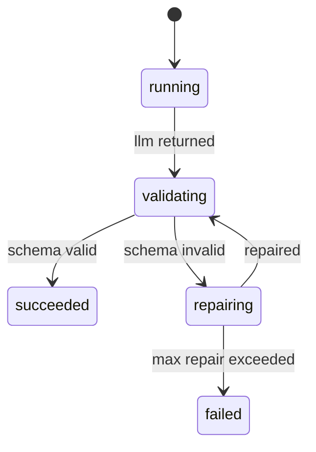

#### 边界条件

- LLM 返回空。
- LLM 返回非 JSON。
- JSON 超出支持 scene type。
- voiceover 文案过长。
- scene 数量为 0。
- 关键词为空。

#### 异常情况

- Provider 超时：按 Inngest 重试。
- Provider 限流：记录 `PROVIDER_RATE_LIMITED`。
- Schema 校验失败：进入 repair。
- repair 仍失败：任务 failed。

#### 权限要求

- 系统任务，需校验 project owner 存在。

#### 安全要求

- 禁止将用户敏感凭据传给 LLM。
- Prompt 中明确禁止生成违法、危险和歧视内容。

#### 埋点设计

- `storyboard_generate_start`
- `storyboard_generate_success`
- `storyboard_generate_failed`
- `storyboard_repair_triggered`

#### 日志设计

- 记录 providerId、model、inputTokens、outputTokens、schemaErrors、latencyMs。

### 功能名称：TTS 音频生成

#### 功能目标

按 scene 生成旁白音频，并记录音频时长用于时间轴计算。

#### 业务规则

- 每个 scene 单独生成一个音频文件。
- 使用可插拔 TTS Provider，首个正式默认 Provider 为 MiniMax TTS；架构上仍允许后续接入任意满足接口契约的 TTS 服务。
- TTS Provider 必须支持高质量中文语音输出，并返回音频二进制或可下载音频地址。
- MiniMax 为首个正式 TTS Provider：同步 HTTP T2A 在开启 `subtitle_enable` 后支持 `sentence`、`word`、`word_streaming` 字幕类型，其中 `word_streaming` 需 `stream=true`；异步长文本 TTS 支持句级字幕时间戳。
- MiniMax 同步 HTTP T2A 单次 text 需小于 10,000 字；官方建议超过 3,000 字使用 streaming output。
- MiniMax 异步 T2A 支持更长文本，text 最大 50,000 字，文件输入最大 1,000,000 字；异步任务完成后需及时下载文件，避免下载 URL 过期。
- 音频格式第一版优先使用 mp3；若 Provider 输出 wav/aac，系统需在入库前统一转码或记录 contentType。
- 若相同 textHash + voiceProvider + voiceId + speed 已存在音频，则复用 Asset。
- durationMs 必须存在；Provider 不返回时用音频分析工具计算。

#### 用户操作流程

用户无直接操作，生成进度页展示阶段。

#### 系统处理逻辑

1. 遍历 Storyboard scenes。
2. 为每个 scene 计算 textHash。
3. 查询是否已有可复用音频 Asset。
4. 无则调用 TTS Provider。
5. 上传音频到 R2。
6. 保存 Asset，更新 Scene voiceover.audioAssetId 和 durationMs。
7. 生成句子级 captions。

#### 状态流转图

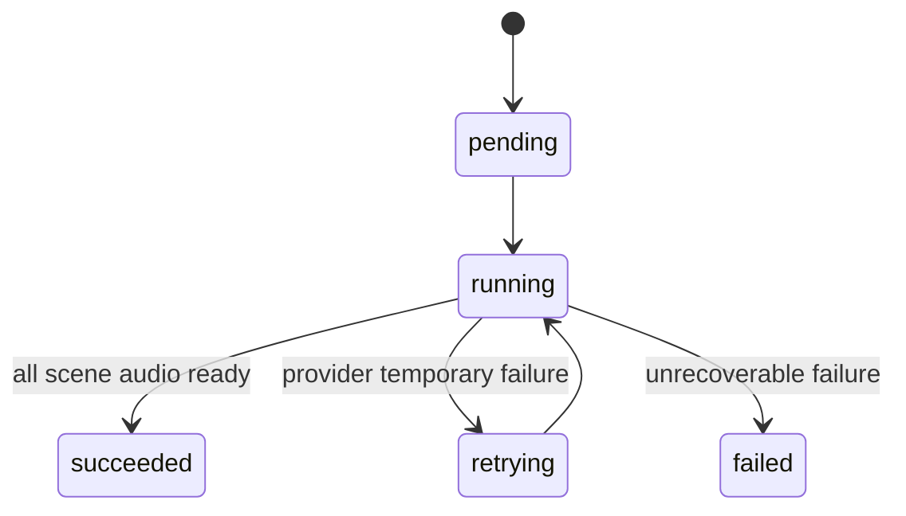

#### 边界条件

- scene 文案为空。
- 单段文案超过 TTS 服务限制。
- TTS 语音不存在或当前 Provider 不支持该 voiceId。
- 音频上传成功但数据库写入失败。
- 数据库写入成功但 scene 回填失败。

#### 异常情况

- TTS Provider 超时：重试。
- TTS Provider 返回错误：根据错误码判断是否重试。
- 音频 duration 解析失败：任务 failed，提示音频分析失败。
- R2 上传失败：重试上传。

#### 权限要求

- 系统任务。

#### 安全要求

- TTS 请求不得携带无关用户信息。
- TTS Provider API Key 仅保存在服务端环境变量或密钥管理服务中。
- 音频文件默认私有，通过签名 URL 访问。

#### 埋点设计

- `tts_scene_start`
- `tts_scene_success`
- `tts_scene_failed`
- `tts_asset_reused`

#### 日志设计

- 记录 sceneId、textHash、voiceId、providerRequestId、durationMs、assetId、latencyMs。

### 功能名称：时间轴计算

#### 功能目标

根据真实音频时长生成 Remotion 可消费的 timeline，解决音画同步问题。

#### 业务规则

- fps 固定为 30。
- scene duration = audio duration + enter buffer + exit buffer。
- 默认 enter buffer = 300ms，exit buffer = 400ms，【待确认】是否按模板配置。
- scene 顺序按 order 升序。
- totalFrames 等于所有 scene durationFrames 之和。

#### 用户操作流程

用户无直接操作。

#### 系统处理逻辑

1. 校验所有 scene 均有 durationMs。
2. 计算 durationFrames。
3. 累加 startFrame。
4. 回填 timeline 到 Storyboard。
5. 保存 StoryboardVersion 渲染快照。

#### 状态流转图

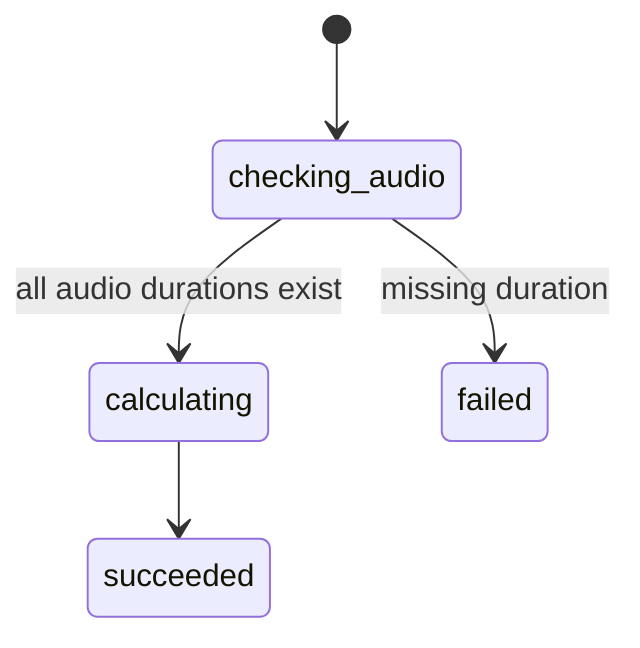

#### 边界条件

- durationMs 为 0。
- durationMs 异常过长。
- totalDuration 超过用户选择目标时长太多。
- scene 顺序重复。

#### 异常情况

- 缺少音频时长：返回 `AUDIO_DURATION_MISSING`。
- scene order 非连续：自动按 order 排序并记录 warning。

#### 权限要求

- 系统任务。

#### 安全要求

- 不接受前端传入 timeline 作为可信数据。

#### 埋点设计

- `timeline_calculate_success`
- `timeline_calculate_failed`

#### 日志设计

- 记录 projectId、storyboardVersionId、totalFrames、totalDurationMs、sceneCount。

### 功能名称：Remotion 渲染

#### 功能目标

基于项目内 Remotion 模板和动效代码，将最终 Storyboard 渲染为 MP4，并生成缩略图。Remotion 不作为单纯外接黑盒服务，而是产品视频效果、页面动效、字幕表现和教学可视化模板的核心实现层。

#### 业务规则

- Remotion 模板、Composition、场景组件和动效代码必须集成在项目仓库内，建议采用 monorepo package 管理。
- 渲染执行使用独立 Remotion Worker 进程/服务，避免阻塞 Next.js Web/API。
- Worker 只消费已校验 Storyboard 和项目内受控模板。
- 渲染输出为 mp4，codec 为 h264。
- 第一版支持 16:9、9:16、1:1。
- 渲染失败可重试，已生成视频不重复渲染。
- 视频效果和动效必须基于 Storyboard JSON 驱动，不允许 LLM 直接生成任意可执行 React 代码。
- 第一版内置 6-8 个 PPT 微课模板，包含入场、强调、步骤揭示、字幕同步和转场动效。

#### 用户操作流程

用户在进度页等待，完成后进入结果页。

#### 系统处理逻辑

1. Inngest 调用 Render Provider。
2. Render Provider 读取项目内 Remotion Composition 和模板注册表。
3. Render Provider 将 Storyboard 和签名资源 URL 传给 Worker。
4. Worker 拉取音频资源。
5. Worker 使用项目内 Remotion 代码渲染视频。
6. 生成缩略图。
7. 上传 MP4 和缩略图到 R2。
8. 写入 Asset 和 RenderJob。
9. Project 状态更新 completed。

#### 状态流转图

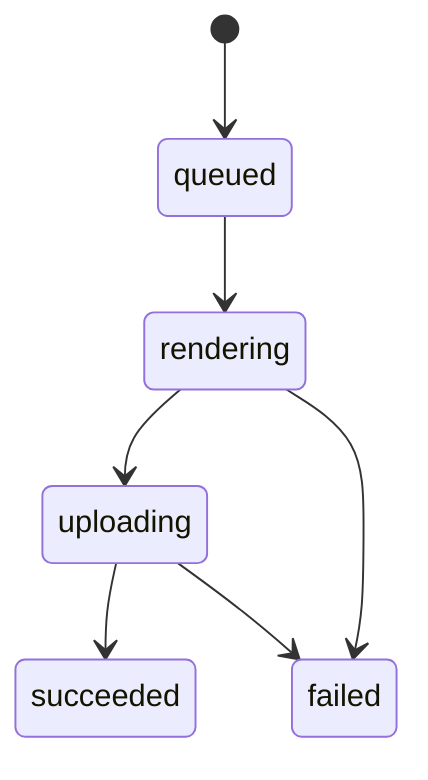

#### 边界条件

- 中文字体缺失。
- 音频签名 URL 过期。
- Worker 磁盘空间不足。
- 视频总时长超限。
- R2 上传大文件失败。
- Storyboard 引用了不存在的 Remotion 模板。
- Remotion Composition 版本与 Storyboard schemaVersion 不兼容。

#### 异常情况

- Chromium 启动失败：任务 failed，报警。
- FFmpeg 编码失败：可重试一次。
- 单个音频拉取失败：刷新签名 URL 后重试。
- 渲染超时：终止进程，标记 failed。

#### 权限要求

- 系统任务。

#### 安全要求

- Worker 不暴露公开渲染接口，需内部 token。
- Storyboard 中不允许外部任意资源 URL。
- LLM 不得直接生成 Remotion/React/JSX 代码；只能生成受 Schema 限制的视觉意图和模板参数。

#### 埋点设计

- `render_start`
- `render_success`
- `render_failed`

#### 日志设计

- 记录 renderJobId、workerId、durationMs、outputSizeBytes、errorStack、resourceUsage。

### 功能名称：资源访问与下载

#### 功能目标

为视频、字幕、音频等资源提供安全访问。

#### 业务规则

- 所有 R2 文件默认私有。
- 前端访问通过签名 URL。
- 签名 URL 有效期默认 10 分钟。
- 下载行为需校验项目权限。

#### 用户操作流程

1. 用户进入视频结果页。
2. 前端请求签名播放 URL。
3. 用户点击下载 MP4 或字幕。

#### 系统处理逻辑

1. 校验用户权限。
2. 查询 Asset。
3. 调用 Storage Provider 获取 signedUrl。
4. 返回前端。

#### 状态流转图

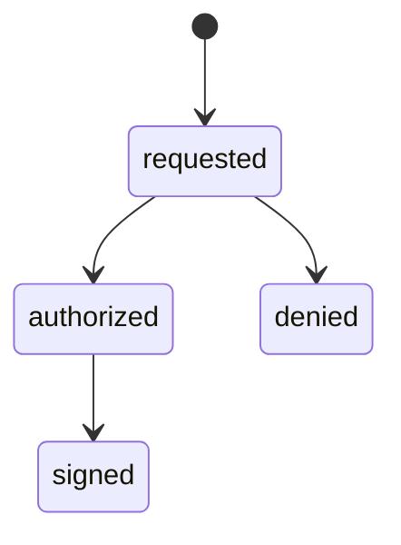

#### 边界条件

- Asset 不存在。
- Asset 不属于用户项目。
- R2 key 缺失。
- 签名 URL 生成失败。

#### 异常情况

- 权限不足：返回 `FORBIDDEN`。
- 文件不存在：返回 `ASSET_NOT_FOUND`。

#### 权限要求

- 项目 owner 或管理员。

#### 安全要求

- 不返回 R2 私有凭据。
- 不允许通过 assetId 枚举下载他人文件。

#### 埋点设计

- `asset_signed_url_requested`
- `asset_download_started`

#### 日志设计

- 记录 userId、assetId、projectId、assetType、expiresInSec。

### 功能名称：Provider 抽象管理

#### 功能目标

将 LLM、TTS、Storage、Render 能力封装为稳定接口，业务流程只依赖接口契约，不直接依赖具体厂商 SDK。

#### 业务规则

- LLM 第一版默认 Provider 为 `deepseek`，通过 OpenAI-compatible API 适配。
- TTS 第一版默认 Provider 为 `minimax`，但必须通过 `TtsProvider` 接口接入，不允许在业务流程中写死厂商 SDK。
- TTS Provider 必须返回音频二进制或可下载地址，且系统最终必须获得 `durationMs`。
- Storage 第一版 Provider 为 `cloudflare-r2`。
- Render 第一版 Provider 为 `remotion-worker`。
- Provider 配置第一版通过服务端环境变量完成，不提供管理员配置后台。
- Provider 调用失败需统一映射为平台错误码。

#### 接口契约

```ts
export interface LlmProvider {
  id: "deepseek" | string;
  type: "llm";

  generateStoryboard(input: {
    rawText: string;
    audienceRole: "student" | "teacher";
    audienceLevel?: string;
    aspectRatio: "16:9" | "9:16" | "1:1";
    targetDurationSec: 60 | 180 | 300;
    language: "zh-CN";
  }): Promise<Storyboard>;

  repairStoryboardJson(input: {
    invalidOutput: string;
    schemaErrors: Array<{
      path: string;
      message: string;
    }>;
  }): Promise<Storyboard>;
}

export interface TtsProvider {
  id: string;
  type: "tts";
  vendor: "minimax" | string;

  listVoices(input: {
    language: "zh-CN" | "en-US";
  }): Promise<Array<{
    voiceId: string;
    name: string;
    language: string;
    gender?: "male" | "female" | "neutral";
    style?: string;
    sampleUrl?: string;
  }>>;

  synthesize(input: {
    text: string;
    voiceId: string;
    speed?: number;
    format: "mp3" | "wav";
  }): Promise<{
    audioBuffer?: Buffer;
    audioUrl?: string;
    contentType: string;
    durationMs?: number;
    captions?: CaptionSegment[];
    providerRequestId?: string;
  }>;
}

export interface StorageProvider {
  id: "cloudflare-r2" | string;
  type: "storage";

  upload(input: {
    key: string;
    body: Buffer | ReadableStream;
    contentType: string;
    metadata?: Record<string, string>;
  }): Promise<{
    key: string;
    sizeBytes?: number;
    checksum?: string;
  }>;

  getSignedUrl(input: {
    key: string;
    expiresInSec: number;
    purpose: "preview" | "download" | "render";
  }): Promise<string>;
}

export interface RenderProvider {
  id: "remotion-worker" | string;
  type: "render";

  render(input: {
    renderJobId: string;
    storyboard: Storyboard;
    outputKey: string;
  }): Promise<{
    videoAssetKey: string;
    thumbnailAssetKey?: string;
    durationMs: number;
    sizeBytes: number;
  }>;
}
```

#### 用户操作流程

用户无直接操作。用户仅在创建页选择可用语音，前端展示由服务端返回的 voice list。

#### 系统处理逻辑

1. 服务启动时读取 Provider 环境变量。
2. 后端注册可用 Provider。
3. 创建页通过 API 获取当前可用 TTS voices。
4. 生成任务按项目记录的 providerId 调用对应 Provider。
5. Provider 返回结果后统一转换为平台内部数据结构。
6. 调用失败时记录 providerId、requestId、latencyMs 和标准错误码。

#### 状态流转图

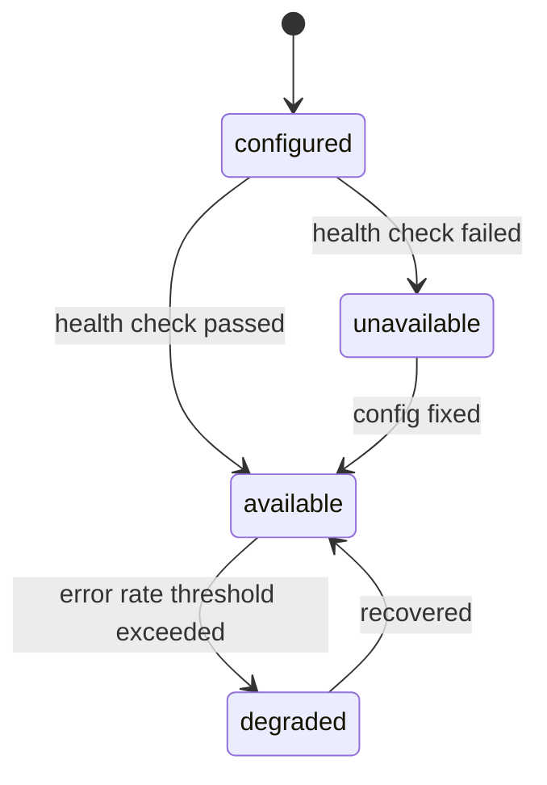

#### 边界条件

- Provider 环境变量缺失。
- Provider health check 失败。
- TTS Provider 不支持中文。
- TTS Provider 返回音频 URL 但下载失败。
- TTS Provider 返回格式不在支持列表中。
- MiniMax 同步 T2A 文本超过接口限制。
- MiniMax 异步 T2A 下载 URL 过期。
- DeepSeek 返回内容不符合 Storyboard Schema。

#### 异常情况

- Provider 不可用：阻止创建任务或在任务阶段 failed。
- Provider 限流：标记 retrying，并按 Inngest 策略重试。
- Provider 返回未知错误：映射为 `PROVIDER_UNKNOWN_ERROR`。

#### 权限要求

- 普通用户不可查看或修改 Provider 配置。
- 管理员第一版无配置页面，仅可通过服务端日志排查。

#### 安全要求

- Provider API Key 不得返回前端。
- Provider 请求日志不得记录完整密钥、敏感 Header 或用户隐私数据。

#### 埋点设计

- `provider_call_start`
- `provider_call_success`
- `provider_call_failed`
- `provider_health_changed`

#### 日志设计

- 记录 providerId、providerType、operation、latencyMs、status、standardErrorCode、providerRequestId。

---

## 10. 数据模型设计

### 实体关系

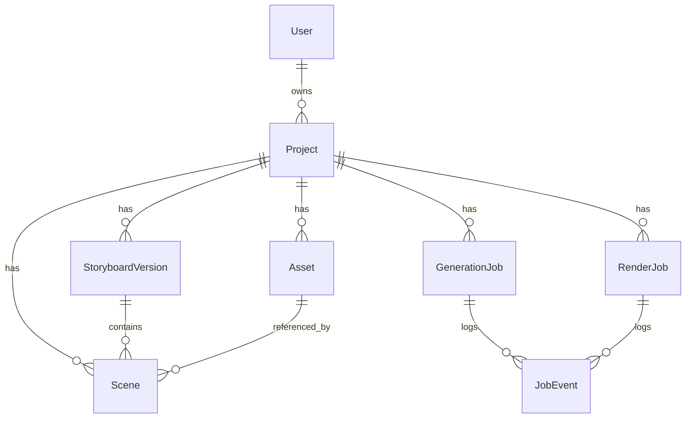

### 表结构

#### User

由 better-auth 管理，业务侧仅依赖 userId。具体字段以 better-auth schema 为准。

#### Project

| 字段 | 类型 | 说明 |
| -- | -- | -- |
| id | String | 主键，cuid |
| userId | String | 外键，better-auth user id，索引 |
| title | String | 项目标题 |
| sourceText | Text | 原始 AI 回答文本 |
| status | ProjectStatus | 项目状态，索引 |
| audienceRole | String | student / teacher |
| audienceLevel | String? | 年级或难度 |
| aspectRatio | String | 16:9 / 9:16 / 1:1 |
| targetDurationSec | Int | 目标时长 |
| voiceProvider | String | 当前 TTS Provider ID |
| voiceId | String | 语音 ID |
| currentStoryboardVersionId | String? | 当前分镜版本 |
| finalVideoAssetId | String? | 最终视频资源 |
| thumbnailAssetId | String? | 缩略图资源 |
| errorCode | String? | 最近失败错误码 |
| errorMessage | String? | 最近失败信息 |
| createdAt | DateTime | 创建时间，索引 |
| updatedAt | DateTime | 更新时间 |

索引：`userId_createdAt_idx`、`status_idx`。外键：`userId` 关联 better-auth user。

#### StoryboardVersion

| 字段 | 类型 | 说明 |
| -- | -- | -- |
| id | String | 主键 |
| projectId | String | 外键，索引 |
| version | Int | 版本号，project 内唯一 |
| schemaVersion | String | Storyboard schema 版本 |
| status | String | draft / valid / rendered |
| storyboardJson | Json | 结构化分镜 |
| storyboardAssetId | String? | R2 JSON 文件 |
| totalFrames | Int? | 总帧数 |
| totalDurationMs | Int? | 总时长 |
| contentHash | String | 分镜内容 hash |
| createdAt | DateTime | 创建时间 |

唯一约束：`projectId + version`。索引：`projectId_createdAt_idx`。

#### Scene

| 字段 | 类型 | 说明 |
| -- | -- | -- |
| id | String | 主键 |
| projectId | String | 外键，索引 |
| storyboardVersionId | String | 外键，索引 |
| sceneKey | String | scene_001 等 |
| order | Int | 顺序 |
| type | String | scene type |
| title | String? | 标题 |
| voiceoverText | Text | 旁白 |
| visualJson | Json | 可视化结构 |
| animationJson | Json | 动画结构 |
| audioAssetId | String? | 音频 Asset |
| durationMs | Int? | 音频时长 |
| startFrame | Int? | 起始帧 |
| durationFrames | Int? | 持续帧 |
| captionsJson | Json? | 字幕 |
| createdAt | DateTime | 创建时间 |

唯一约束：`storyboardVersionId + sceneKey`、`storyboardVersionId + order`。

#### Asset

| 字段 | 类型 | 说明 |
| -- | -- | -- |
| id | String | 主键 |
| userId | String | 所属用户，索引 |
| projectId | String? | 所属项目，索引 |
| type | AssetType | source_text / audio / caption / image / thumbnail / video / storyboard_json |
| provider | String | r2 |
| bucket | String | R2 bucket |
| key | String | R2 key，唯一 |
| url | String? | 可选公开 URL，不建议存签名 URL |
| contentType | String | MIME |
| sizeBytes | Int? | 文件大小 |
| durationMs | Int? | 音视频时长 |
| width | Int? | 宽 |
| height | Int? | 高 |
| checksum | String? | 内容校验 |
| metadata | Json? | 扩展字段 |
| createdAt | DateTime | 创建时间 |

唯一约束：`key`。索引：`userId_type_idx`、`projectId_type_idx`、`checksum_idx`。

#### GenerationJob

| 字段 | 类型 | 说明 |
| -- | -- | -- |
| id | String | 主键 |
| projectId | String | 外键，索引 |
| userId | String | 用户 ID，索引 |
| status | JobStatus | pending / running / succeeded / failed / retrying / cancelled |
| currentStep | String? | 当前步骤 |
| inngestRunId | String? | Inngest run id |
| idempotencyKey | String | 幂等键，唯一 |
| attempt | Int | 尝试次数 |
| errorCode | String? | 错误码 |
| errorMessage | String? | 错误信息 |
| startedAt | DateTime? | 开始时间 |
| finishedAt | DateTime? | 完成时间 |
| createdAt | DateTime | 创建时间 |

唯一约束：`idempotencyKey`。索引：`projectId_status_idx`。

#### RenderJob

| 字段 | 类型 | 说明 |
| -- | -- | -- |
| id | String | 主键 |
| projectId | String | 外键，索引 |
| storyboardVersionId | String | 分镜版本，索引 |
| status | JobStatus | 状态 |
| renderConfigHash | String | 渲染配置 hash |
| remotionTemplateVersion | String | Remotion 模板代码版本 |
| outputAssetId | String? | MP4 Asset |
| thumbnailAssetId | String? | 缩略图 Asset |
| workerId | String? | Worker 标识 |
| attempt | Int | 尝试次数 |
| errorCode | String? | 错误码 |
| errorMessage | String? | 错误信息 |
| startedAt | DateTime? | 开始时间 |
| finishedAt | DateTime? | 完成时间 |
| createdAt | DateTime | 创建时间 |

唯一约束：`storyboardVersionId + renderConfigHash`。

#### JobEvent

| 字段 | 类型 | 说明 |
| -- | -- | -- |
| id | String | 主键 |
| projectId | String | 项目 ID，索引 |
| jobId | String | GenerationJob 或 RenderJob ID，索引 |
| jobType | String | generation / render |
| level | String | info / warn / error |
| event | String | 事件名 |
| message | String? | 文案 |
| metadata | Json? | 扩展 |
| createdAt | DateTime | 创建时间，索引 |

#### UsageRecord

| 字段 | 类型 | 说明 |
| -- | -- | -- |
| id | String | 主键 |
| userId | String | 用户 ID，索引 |
| projectId | String? | 项目 ID，索引 |
| provider | String | llm / tts / remotion / r2 |
| metric | String | tokens / chars / render_ms / bytes |
| quantity | Int | 数量 |
| unit | String | token / char / ms / byte |
| costEstimate | Decimal? | 预估成本 |
| metadata | Json? | 扩展 |
| createdAt | DateTime | 创建时间 |

---

## 11. API设计

说明：对外前端 API 使用 tRPC，此处以 RPC path 描述；内部 Worker API 使用 HTTP。

### 接口名称：创建并启动生成

### Method

Mutation

### Path

`project.createAndGenerate`

### Request

```json
{
  "type": "object",
  "required": ["sourceText", "audienceRole", "aspectRatio", "targetDurationSec", "voiceProvider", "voiceId"],
  "properties": {
    "sourceText": { "type": "string", "minLength": 50, "maxLength": 5000 },
    "audienceRole": { "type": "string", "enum": ["student", "teacher"] },
    "audienceLevel": { "type": "string" },
    "aspectRatio": { "type": "string", "enum": ["16:9", "9:16", "1:1"] },
    "targetDurationSec": { "type": "number", "enum": [60, 180, 300] },
    "voiceProvider": { "type": "string" },
    "voiceId": { "type": "string" },
    "requestId": { "type": "string" }
  }
}
```

### Response

```json
{
  "type": "object",
  "required": ["projectId", "status"],
  "properties": {
    "projectId": { "type": "string" },
    "status": { "type": "string", "enum": ["queued"] }
  }
}
```

### 错误码

| Code | 说明 |
| ---- | -- |
| UNAUTHORIZED | 未登录 |
| INVALID_INPUT | 参数错误 |
| QUOTA_EXCEEDED | 额度不足 |
| CONCURRENT_LIMIT_EXCEEDED | 并发任务超限 |
| PROJECT_CREATE_FAILED | 项目创建失败 |
| EVENT_DISPATCH_FAILED | 任务事件发送失败 |

### 权限要求

登录用户。

### 限流策略

同一用户每分钟最多 5 次提交；同一 requestId 只处理一次。

### 接口名称：项目列表

### Method

Query

### Path

`project.list`

### Request

```json
{
  "type": "object",
  "properties": {
    "status": { "type": "string" },
    "cursor": { "type": "string" },
    "limit": { "type": "number", "minimum": 1, "maximum": 50 }
  }
}
```

### Response

```json
{
  "type": "object",
  "required": ["items"],
  "properties": {
    "items": {
      "type": "array",
      "items": {
        "type": "object",
        "properties": {
          "id": { "type": "string" },
          "title": { "type": "string" },
          "status": { "type": "string" },
          "thumbnailUrl": { "type": "string" },
          "createdAt": { "type": "string" },
          "targetDurationSec": { "type": "number" },
          "errorMessage": { "type": "string" }
        }
      }
    },
    "nextCursor": { "type": "string" }
  }
}
```

### 错误码

| Code | 说明 |
| ---- | -- |
| UNAUTHORIZED | 未登录 |
| INTERNAL_ERROR | 服务异常 |

### 权限要求

登录用户。

### 限流策略

每用户每分钟 120 次。

### 接口名称：项目详情

### Method

Query

### Path

`project.getById`

### Request

```json
{
  "type": "object",
  "required": ["projectId"],
  "properties": {
    "projectId": { "type": "string" }
  }
}
```

### Response

```json
{
  "type": "object",
  "properties": {
    "project": { "type": "object" },
    "currentJob": { "type": "object" },
    "storyboard": { "type": "object" },
    "assets": { "type": "array" }
  }
}
```

### 错误码

| Code | 说明 |
| ---- | -- |
| UNAUTHORIZED | 未登录 |
| FORBIDDEN | 无权限 |
| PROJECT_NOT_FOUND | 项目不存在 |

### 权限要求

项目 owner 或管理员。

### 限流策略

每用户每分钟 180 次。

### 接口名称：取消生成

### Method

Mutation

### Path

`generation.cancel`

### Request

```json
{
  "type": "object",
  "required": ["projectId"],
  "properties": {
    "projectId": { "type": "string" }
  }
}
```

### Response

```json
{
  "type": "object",
  "properties": {
    "projectId": { "type": "string" },
    "status": { "type": "string", "enum": ["cancelled"] }
  }
}
```

### 错误码

| Code | 说明 |
| ---- | -- |
| FORBIDDEN | 无权限 |
| PROJECT_NOT_RUNNING | 项目不在运行中 |
| CANCEL_FAILED | 取消失败 |

### 权限要求

项目 owner 或管理员。

### 限流策略

每项目每分钟 3 次。

### 接口名称：重试生成

### Method

Mutation

### Path

`generation.retry`

### Request

```json
{
  "type": "object",
  "required": ["projectId"],
  "properties": {
    "projectId": { "type": "string" },
    "mode": { "type": "string", "enum": ["resume", "full_regenerate"] }
  }
}
```

### Response

```json
{
  "type": "object",
  "properties": {
    "projectId": { "type": "string" },
    "jobId": { "type": "string" },
    "status": { "type": "string", "enum": ["queued"] }
  }
}
```

### 错误码

| Code | 说明 |
| ---- | -- |
| FORBIDDEN | 无权限 |
| PROJECT_NOT_RETRYABLE | 项目不可重试 |
| QUOTA_EXCEEDED | 额度不足 |

### 权限要求

项目 owner 或管理员。

### 限流策略

每项目每 5 分钟最多 2 次。

### 接口名称：获取资源签名 URL

### Method

Query

### Path

`asset.getSignedUrl`

### Request

```json
{
  "type": "object",
  "required": ["assetId", "purpose"],
  "properties": {
    "assetId": { "type": "string" },
    "purpose": { "type": "string", "enum": ["preview", "download"] }
  }
}
```

### Response

```json
{
  "type": "object",
  "required": ["url", "expiresAt"],
  "properties": {
    "url": { "type": "string" },
    "expiresAt": { "type": "string" }
  }
}
```

### 错误码

| Code | 说明 |
| ---- | -- |
| FORBIDDEN | 无权限 |
| ASSET_NOT_FOUND | 资源不存在 |
| SIGN_URL_FAILED | 签名失败 |

### 权限要求

项目 owner 或管理员。

### 限流策略

每用户每分钟 120 次。

### 接口名称：获取可用 TTS 语音列表

### Method

Query

### Path

`provider.listTtsVoices`

### Request

```json
{
  "type": "object",
  "properties": {
    "providerId": { "type": "string" },
    "language": { "type": "string", "enum": ["zh-CN", "en-US"] }
  }
}
```

### Response

```json
{
  "type": "object",
  "required": ["providers"],
  "properties": {
    "providers": {
      "type": "array",
      "items": {
        "type": "object",
        "required": ["providerId", "voices"],
        "properties": {
          "providerId": { "type": "string" },
          "displayName": { "type": "string" },
          "voices": {
            "type": "array",
            "items": {
              "type": "object",
              "required": ["voiceId", "name", "language"],
              "properties": {
                "voiceId": { "type": "string" },
                "name": { "type": "string" },
                "language": { "type": "string" },
                "gender": { "type": "string" },
                "style": { "type": "string" },
                "sampleUrl": { "type": "string" }
              }
            }
          }
        }
      }
    }
  }
}
```

### 错误码

| Code | 说明 |
| ---- | -- |
| UNAUTHORIZED | 未登录 |
| PROVIDER_UNAVAILABLE | Provider 不可用 |
| VOICE_LIST_FAILED | 获取语音列表失败 |

### 权限要求

登录用户。

### 限流策略

每用户每分钟 60 次；结果可缓存 1 小时。

### 接口名称：Remotion Worker 渲染

### Method

POST

### Path

`/internal/render`

### Request

```json
{
  "type": "object",
  "required": ["renderJobId", "storyboard", "outputKey"],
  "properties": {
    "renderJobId": { "type": "string" },
    "storyboard": { "type": "object" },
    "outputKey": { "type": "string" },
    "callbackUrl": { "type": "string" }
  }
}
```

### Response

```json
{
  "type": "object",
  "required": ["videoAssetKey", "durationMs", "sizeBytes"],
  "properties": {
    "videoAssetKey": { "type": "string" },
    "thumbnailAssetKey": { "type": "string" },
    "durationMs": { "type": "number" },
    "sizeBytes": { "type": "number" }
  }
}
```

### 错误码

| Code | 说明 |
| ---- | -- |
| UNAUTHORIZED_INTERNAL | 内部 token 无效 |
| INVALID_STORYBOARD | 分镜不合法 |
| RENDER_FAILED | 渲染失败 |
| UPLOAD_FAILED | 上传失败 |

### 权限要求

内部服务 token。

### 限流策略

按 Worker 并发限制，默认每实例 1 个并发渲染。

---

## 12. 状态机设计

### ProjectStatus

| 状态流转 | 触发条件 | 失败条件 | 回滚逻辑 |
| -- | -- | -- | -- |
| draft → queued | 用户提交生成 | 参数校验失败 | 保持 draft 或不创建项目 |
| queued → generating_storyboard | Inngest 开始执行 | Inngest 启动失败 | queued → failed |
| generating_storyboard → storyboard_ready | Storyboard 生成并校验成功 | LLM 或 schema 失败 | generating_storyboard → failed |
| storyboard_ready → generating_audio | 开始 TTS | 无 scenes | storyboard_ready → failed |
| generating_audio → calculating_timeline | 所有音频生成成功 | TTS 失败且重试耗尽 | generating_audio → failed |
| calculating_timeline → rendering | timeline 计算成功 | duration 缺失 | calculating_timeline → failed |
| rendering → completed | MP4 上传成功 | 渲染或上传失败 | rendering → failed |
| 任意运行态 → cancelled | 用户取消 | 任务已完成 | 不允许取消，返回错误 |
| failed → queued | 用户点击重试 | 额度不足 | 保持 failed |

### JobStatus

| 状态流转 | 触发条件 | 失败条件 | 回滚逻辑 |
| -- | -- | -- | -- |
| pending → running | Worker/Inngest step 开始 | 任务不存在 | 标记 failed |
| running → retrying | 可重试错误 | 超过重试次数 | retrying → failed |
| retrying → running | 重试开始 | 取消任务 | retrying → cancelled |
| running → succeeded | step 完成 | 无 | 无 |
| running → failed | 不可恢复错误 | 无 | 记录错误码 |
| pending/running/retrying → cancelled | 用户取消 | 已 succeeded | 不回滚已完成资产 |

### AssetType 状态

第一版 Asset 无独立状态字段，依赖引用关系与 Job 状态。若需清理临时文件，建议新增 `lifecycleStatus: active / temporary / orphaned / deleted`。【待确认】

---

## 13. 权限模型

角色：

- 游客
- 普通用户
- 管理员

| 功能 | 游客 | 用户 | 管理员 |
| -- | -- | -- | --- |
| 访问首页/登录页 | 允许 | 允许 | 允许 |
| 查看 Dashboard | 禁止 | 仅自己 | 服务端允许全部，第一版无后台页面 |
| 创建项目 | 禁止 | 允许，受额度限制 | 允许 |
| 查看项目详情 | 禁止 | 仅自己 | 允许 |
| 取消任务 | 禁止 | 仅自己 | 允许 |
| 重试任务 | 禁止 | 仅自己，受额度限制 | 允许 |
| 下载视频 | 禁止 | 仅自己 | 允许 |
| 下载字幕 | 禁止 | 仅自己 | 允许 |
| 删除项目 | 禁止 | 仅自己 | 允许 |
| 查看系统日志 | 禁止 | 禁止 | 允许 |
| 配置 Provider | 禁止 | 禁止 | 第一版不提供页面，通过环境变量配置 |

---

## 14. 非功能需求（NFR）

### 性能

- 创建项目接口 P95 <= 800ms，不等待生成完成。
- 项目详情查询 P95 <= 500ms。
- 列表查询 P95 <= 800ms。
- 3 分钟视频端到端生成 P75 <= 8 分钟。
- Remotion Worker 单实例默认并发 1，避免 CPU/内存争抢。

### 安全

- 所有业务接口必须校验 better-auth session。
- R2 bucket 默认私有。
- 资源访问必须通过签名 URL。
- 内部 Worker API 必须使用 internal token。
- 用户输入内容需做基础内容安全检查。
- Provider API Key 仅在服务端环境变量保存。
- 禁止前端直接访问 TTS Provider、LLM 和 R2 写权限。

### 可用性

- 生成失败必须展示可理解错误原因。
- 支持失败重试。
- 支持取消生成。
- 长任务状态可查询。
- 已生成的中间资产可复用。

### 可观测性

- Inngest step 级日志。
- JobEvent 表记录业务事件。
- Sentry 记录前后端异常。
- Worker 记录 renderJobId、资源消耗、错误栈。
- Provider 调用记录 latency、错误码和 requestId。

### 监控

- 任务成功率。
- 任务失败率。
- 各阶段耗时。
- Provider 错误率。
- R2 上传失败率。
- Worker CPU、内存、磁盘。
- 视频渲染平均耗时。

### 审计日志

- 用户创建项目、取消、重试、删除、下载资源需记录审计日志。
- 管理员查看或操作用户项目需记录审计日志。

### 灾备方案

- 数据库每日备份。
- R2 文件删除后不保留。用户删除项目或资源时，系统在权限校验通过后删除数据库引用并物理删除 R2 对象；若 R2 删除失败，记录待清理任务并重试。
- Inngest 任务可通过 Job 状态恢复。
- 渲染临时文件可定期清理。

---

## 15. 风险评估

| 风险类型 | 风险 | 影响 | 缓解措施 |
| -- | -- | -- | -- |
| 技术风险 | LLM 输出 JSON 不稳定 | 分镜生成失败 | JSON Schema 校验、repair、有限 scene type |
| 技术风险 | TTS 音频时长不准确 | 音画不同步 | 逐 scene TTS、服务端解析 duration、timeline validation |
| 技术风险 | Remotion Worker 部署复杂 | 渲染失败率高 | Docker 化、预装中文字体、限制并发 |
| 技术风险 | R2 签名 URL 过期 | 渲染拉取资源失败 | Worker 渲染前生成足够长有效期 URL 或服务端代理 |
| 技术风险 | Remotion 模板代码与 Worker 部署版本不一致 | 渲染结果不可复现 | 使用 monorepo 统一版本，RenderJob 记录 remotionTemplateVersion |
| 业务风险 | 生成效果不符合老师预期 | 留存低 | 固定高质量模板、分镜预览、后续支持编辑 |
| 业务风险 | 成本不可控 | 毛利为负 | 额度、并发限制、UsageRecord |
| 数据风险 | 中间状态不一致 | 任务无法恢复 | 幂等键、JobEvent、阶段性落库 |
| 运营风险 | 失败原因不透明 | 用户投诉 | 错误码映射用户友好提示 |
| 法律合规风险 | 用户输入侵权或敏感内容 | 合规风险 | 内容审核、用户协议、举报和删除机制 |
| 法律合规风险 | TTS 语音授权不清 | 商业使用风险 | 选择可商用 voice，记录 provider 与 voiceId |
| 法律合规风险 | Remotion 存在特殊 license，部分公司场景可能需要商业许可 | 商业化受阻 | 开发前确认 Remotion license 适用范围，必要时购买或申请对应许可 |

---

## 16. 验收标准（Acceptance Criteria）

### 正常流程：创建并生成视频

Given 用户已登录且额度充足  
When 用户粘贴 1000 字 AI 回答并选择 3 分钟、16:9、某个可用 TTS 语音后提交  
Then 系统创建 Project，状态为 queued，并跳转到进度页

Given Project 已进入生成流程  
When Storyboard、TTS、timeline、render 均执行成功  
Then Project 状态为 completed，视频结果页可播放 MP4 并下载

### 异常流程：LLM 返回非法 JSON

Given LLM 返回不符合 Schema 的 JSON  
When 系统校验失败  
Then 系统调用 repair，最多重试 2 次，并记录 `storyboard_repair_triggered`

Given repair 超过最大次数仍失败  
When 任务结束  
Then Project 状态为 failed，前端展示“分镜生成失败，请重试”

### 异常流程：TTS 单段失败

Given 第 5 个 scene 调用 TTS 超时  
When 错误可重试  
Then Inngest 仅重试该步骤，已成功的音频 Asset 不重复生成

### 异常流程：渲染失败

Given Remotion Worker FFmpeg 编码失败  
When render step 失败  
Then RenderJob 状态为 retrying 或 failed，并记录错误栈

### 边界情况：文本为空

Given 用户未输入文本  
When 点击生成  
Then 生成按钮不可点击，页面提示“请先粘贴 AI 回答”

### 边界情况：文本过长

Given 用户输入超过最大字数  
When 点击生成  
Then 前端阻止提交，并提示最大字数限制

### 权限：访问他人项目

Given 用户 A 已登录  
When 用户 A 请求用户 B 的 projectId  
Then API 返回 FORBIDDEN，不返回任何项目内容

### 下载：签名 URL

Given 用户拥有项目权限且视频已生成  
When 请求视频下载 URL  
Then 系统返回有效期 10 分钟的签名 URL

---

## 17. 开发拆分建议

### Epic 1：基础工程与数据模型

Story：搭建 Next.js + tRPC + TanStack Query + Prisma 项目结构  
Task：
- 配置 Prisma schema。
- 接入 better-auth session 到 tRPC context。
- 配置 R2 SDK。
- 配置 Inngest endpoint。

工作量：前端 1 人日，后端 3 人日，测试 1 人日。

### Epic 2：项目创建与 Dashboard

Story：用户可创建项目并查看项目列表  
Task：
- 创建页 UI。
- Dashboard UI。
- `project.createAndGenerate`。
- `project.list`。
- 输入校验和额度校验。

工作量：前端 4 人日，后端 3 人日，测试 2 人日。

### Epic 3：Storyboard 生成链路

Story：系统可将 AI 回答生成合法 Storyboard  
Task：
- 定义 Storyboard TypeScript 类型和 Zod Schema。
- 实现 LLM Provider 抽象。
- 实现 OpenAI-compatible 国内模型接入。
- 实现 JSON repair。
- 保存 StoryboardVersion 和 Scene。

工作量：前端 1 人日，后端 5 人日，测试 3 人日。

### Epic 4：TTS 与 Asset 管理

Story：系统可逐 scene 生成音频并上传 R2  
Task：
- 实现 TTS Provider 抽象。
- 接入通用 TTS Provider，并至少完成一个具体 TTS 服务适配。
- 实现音频 duration 解析。
- 实现 Storage Provider。
- 实现 Asset 表读写和签名 URL。

工作量：前端 1 人日，后端 5 人日，测试 3 人日。

### Epic 5：Timeline 与 Remotion 渲染

Story：系统可根据音频时长渲染 MP4  
Task：
- 实现 timeline calculator。
- 在项目内集成 Remotion package。
- 搭建 Remotion Worker 执行环境。
- 实现 6-8 个 PPT 微课模板和动效预设。
- 实现 Remotion 模板注册表，将 Storyboard scene type 映射到 Composition 组件。
- 实现字幕组件。
- 实现视频上传和缩略图生成。

工作量：前端 2 人日，后端 8 人日，测试 5 人日。

### Epic 6：进度页、分镜预览、结果页

Story：用户可查看生成进度、分镜和最终视频  
Task：
- Progress 页面。
- Storyboard Preview 页面。
- Video Result 页面。
- TanStack Query 轮询。
- Zustand 当前 scene 状态。

工作量：前端 6 人日，后端 2 人日，测试 3 人日。

### Epic 7：错误处理、日志与监控

Story：系统具备可观测性和可恢复性  
Task：
- JobEvent 日志。
- 错误码映射。
- Sentry 接入。
- UsageRecord。
- 重试和取消。

工作量：前端 2 人日，后端 5 人日，测试 3 人日。

---

## 18. 技术实现建议

### 代码组织建议

建议采用 monorepo 结构，将 Remotion 作为项目内核心 package 集成：

```text
apps
├── web                 # Next.js App Router、tRPC、页面 UI
└── render-worker       # Remotion 渲染执行进程/服务
packages
├── storyboard          # Storyboard 类型、Zod Schema、timeline calculator
├── remotion-video      # Remotion Composition、模板组件、动效预设、字幕组件
├── providers           # LLM / TTS / Storage / Render Provider 抽象与适配器
├── db                  # Prisma schema 和数据库访问
└── shared              # 通用类型、错误码、埋点常量
```

边界规则：

- `packages/remotion-video` 负责视频画面、动效、字幕和模板注册表。
- `apps/render-worker` 负责加载 `packages/remotion-video` 并执行渲染。
- `apps/web` 可复用 Remotion 模板做静态分镜预览，但不在 Web 请求中执行最终视频渲染。
- `packages/storyboard` 是 LLM、TTS、Remotion 和前端预览之间的协议层。
- LLM 只输出 Storyboard JSON，不输出 Remotion/React/JSX 代码。

### 数据库设计建议

- Project、StoryboardVersion、Scene、Asset、GenerationJob、RenderJob 必须独立建模。
- StoryboardVersion 保留完整 JSON 快照，Scene 表提供查询和预览效率。
- Asset 只存 metadata，不存二进制。
- 对 `userId + createdAt`、`projectId + status`、`storyboardVersionId + order` 建索引。
- 所有 Job 使用 idempotencyKey 防止重复执行。

### API设计建议

- 前端业务 API 使用 tRPC。
- Worker 内部 API 使用 HTTP + internal token。
- 所有 mutation 使用 Zod 校验。
- 资源下载通过 `asset.getSignedUrl`，不要直接返回长期公开 URL。

### 缓存策略

- TanStack Query 缓存项目列表和项目详情。
- 生成中项目开启短轮询，完成后停止轮询。
- Provider voice list 可缓存 1 小时。
- Asset signed URL 不缓存到数据库，只缓存到前端有效期内。

### 权限设计

- tRPC context 中注入 session userId。
- 所有 projectId 查询必须带 userId 条件或管理员判断。
- Worker API 只能由后端调用。
- 管理员能力第一版只保留后端权限判断和日志排查能力，不做前台后台页面。

### 可扩展性设计

- Provider 抽象支持替换 LLM、TTS、Storage、Render。
- Storyboard schemaVersion 支持后续升级。
- Render Provider 第一版为项目内 Remotion 集成，后续可接 HyperFrames 或其他渲染器。
- Scene type 先限制，后续增量扩展。
- StoryboardVersion 支持未来编辑器和版本回滚。
- Remotion 模板需通过模板注册表扩展，新增模板不得破坏已有 StoryboardVersion 的渲染兼容性。

### 风险点

- 中文字体和 Remotion Worker 环境必须提前验证。
- Remotion license 需要在商业化前确认是否需要公司许可。
- Remotion 模板代码应随应用版本发布，RenderJob 需记录模板版本以便问题追溯。
- TTS Provider 是否返回时间戳取决于具体服务；MiniMax 同步 HTTP T2A 可支持句级和词级时间戳，异步长文本 TTS 可支持句级时间戳。若具体服务无时间戳，第一版使用句子级估算。
- 国内大模型 JSON 稳定性需要压测。
- 生成成本需要从第一天记录 UsageRecord。
- R2 私有资源的签名 URL 有效期需覆盖渲染耗时。

---

# 产品评审

## 需求缺失项

- 默认国内大模型已明确为 DeepSeek，并通过 OpenAI-compatible Provider 接入。
- TTS 业务流程不绑定 MiniMax SDK，但首个正式默认 Provider 为 MiniMax。词级时间戳优先使用同步 HTTP T2A 能力；异步长文本场景使用句级字幕。
- 免费额度刷新周期已明确为每日刷新；每日免费完整视频生成次数仍需最终定案，建议 MVP 默认为每日 1 个。
- 未明确是否支持公开分享。【待确认】建议第一版不做公开分享。
- 管理员后台已明确第一版不做，仅保留服务端权限能力。

## 边界条件遗漏

- 资源清理策略需要补充：取消任务、失败任务、用户删除项目后的 R2 文件如何处理。
- 生成完成后用户重复点击重试，需要定义是重新生成全链路还是只重渲染。
- 用户修改源文本后是否创建新项目或新版本，第一版应禁止修改源文本。
- TTS 文本过长需拆句或压缩，目前仅定义为失败，需要提供自动拆分策略。

## 权限问题

- 管理员来源采用环境变量邮箱白名单。系统从 better-auth session 中读取当前用户邮箱，并判断是否存在于 `ADMIN_EMAILS` 配置中。
- 分享链接权限未确定，若做公开分享，需要独立 ShareToken 表。
- Asset 访问必须避免仅通过 assetId 判断，要反查 project.userId。

## 状态流转问题

- Project `storyboard_ready` 到 `generating_audio` 是内部瞬态，前端可能看不到，需要 UI 展示映射。
- 用户取消时，Inngest 已运行 step 可能无法立即停止，需要定义“软取消”检查点。
- RenderJob 失败后 Project failed，但 GenerationJob 是否 succeeded 需要明确。建议 GenerationJob 覆盖全链路，RenderJob 独立记录渲染状态。

## 数据一致性风险

- R2 上传成功但数据库写入失败会产生孤儿文件，需要定期清理。
- 数据库写入成功但 R2 上传失败会产生无效 Asset，需要上传后再建 Asset。
- 多次重试可能重复扣费，需要 textHash 和 renderConfigHash 幂等。
- StoryboardVersion JSON 与 Scene 表可能不一致，需要规定以 StoryboardVersion JSON 为渲染真源，Scene 表为查询投影。

## 可扩展性问题

- 第一版 scene type 需要严格限制，但要保留 `visualJson` 扩展字段。
- Storyboard schemaVersion 必须参与渲染兼容判断。
- ProviderCredential 第一版若不做后台配置，也应保留环境变量映射机制。

## 技术实现风险

- Remotion Worker 需要 Docker 化部署，不能依赖 Vercel Serverless。
- 中文字体、FFmpeg、Chromium 版本需要固定。
- Inngest 与 Worker 的长任务超时边界需要验证。
- TTS Provider 输出音频格式、采样率和 Remotion 输出采样率需统一。

---

# 修改后的 PRD

以下为评审后修订项，作为 v1.0.1 需求基线补充到上方 PRD 中执行。

## 修订 1：明确 MVP 技术默认选型

- 国内大模型第一版接入 `OpenAICompatibleProvider`，具体 endpoint 通过环境变量配置。
- 默认模型供应商为 DeepSeek，通过 OpenAI-compatible Provider 接入。
- TTS 第一版采用通用 Provider 抽象，首个正式默认适配器为 MiniMax。若未来具体服务无词级时间戳，则使用句子级字幕估算。
- 认证使用已有 better-auth，管理员角色通过环境变量 `ADMIN_EMAILS` 邮箱白名单判断。
- 第一版不做公开分享。
- 第一版不做管理员后台，仅保留管理员权限判断和必要的日志排查能力。

## 修订 2：补充资源生命周期

Asset 新增字段：

| 字段 | 类型 | 说明 |
| -- | -- | -- |
| lifecycleStatus | String | active / temporary / orphaned / deleted |
| deletedAt | DateTime? | 删除时间 |

资源处理规则：

- 上传成功且数据库写入成功：`active`。
- 上传成功但流程失败且未被引用：`orphaned`。
- 渲染临时文件：`temporary`。
- 用户删除项目：Asset 标记 `deleted`，R2 文件立即物理删除，不做保留；删除失败则进入待清理重试队列。
- 定时任务每日清理 `temporary` 和 `orphaned` 文件；R2 对象一经删除不做保留。

## 修订 3：补充软取消机制

取消任务不强杀所有运行中的外部请求，而是采用软取消：

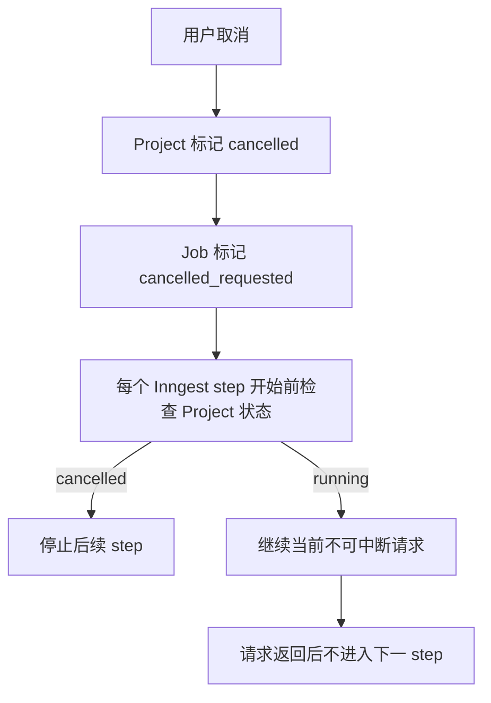

JobStatus 增加：

- `cancel_requested`

## 修订 4：明确重试模式

第一版重试默认使用 `resume`：

- Storyboard 已生成：不重新调用 LLM。
- Scene 音频已存在：不重新调用 TTS。
- Timeline 已计算：可直接进入 render。
- Render 失败：只重试 render。

`full_regenerate` 第一版不开放给普通用户，仅保留管理员调试能力。

## 修订 5：补充 TTS 文本过长处理

若单个 scene voiceover 超过 TTS 服务限制：

1. 优先在 Storyboard 校验阶段要求 LLM 缩短单 scene voiceover。
2. 若仍超过限制，调用 LLM repair 拆分 scene。
3. 若 repair 后仍超限，任务 failed，错误码 `SCENE_VOICEOVER_TOO_LONG`。

## 修订 6：明确 Storyboard 真源

- 渲染真源：`StoryboardVersion.storyboardJson`。
- 查询投影：`Scene` 表。
- 每次修改 StoryboardVersion 后必须同步刷新 Scene 投影。
- 第一版无用户编辑，因此只在生成和 timeline 计算后写入。

## 修订 7：补充前端 UI 稿交付标准

第一版 UI 稿采用 Next.js 可交互原型，而不是仅 Figma：

- 使用 mock 数据覆盖 Dashboard、Create、Progress、Storyboard Preview、Video Result。
- 所有页面必须包含 Loading、Empty、Success、Error 状态。
- Progress 页面需模拟 6 个阶段状态变化。
- Storyboard Preview 需模拟 7 种 scene type。
- Video Result 需使用本地占位视频或 mock URL。

设计风格：

- 教育工具感，浅色背景，主色建议白色和天蓝色。
- 不做营销落地页。
- 不做复杂剪辑软件界面。
- 分镜预览以课件缩略图为核心。

## 修订 8：补充最终错误码分层

错误码分为：

- `USER_INPUT_*`：用户输入错误。
- `AUTH_*`：认证权限错误。
- `QUOTA_*`：额度错误。
- `LLM_*`：大模型错误。
- `STORYBOARD_*`：分镜错误。
- `TTS_*`：语音错误。
- `ASSET_*`：存储错误。
- `RENDER_*`：渲染错误。
- `SYSTEM_*`：系统错误。

前端展示用户友好文案，日志保留原始错误。

## 修订 9：补充 QA 回归重点

QA 必须覆盖：

- 50 字、最大字数、超最大字数。
- 1 分钟、3 分钟、5 分钟配置。
- 三种视频比例。
- LLM 非 JSON。
- TTS 单 scene 失败。
- R2 上传失败。
- Render Worker 超时。
- 用户取消。
- resume 重试不重复生成已存在音频。
- 用户 A 无法访问用户 B 项目和资源。
- 签名 URL 过期后重新获取。

## 修订 10：v1.0.6 结论

PRD v1.0.6 可进入评审；以下事项已在 2026-06-13 补充确认：

- 默认国内大模型：DeepSeek。
- 同一用户并发生成视频数：1。
- TTS：采用通用高质量 TTS Provider 抽象，首个正式默认 Provider 为 MiniMax TTS。
- MiniMax TTS 能力：同步 HTTP T2A 可提供句级/词级/流式词级时间戳；同步 text 小于 10,000 字，超过 3,000 字建议流式；异步长文本 TTS 可提供句级时间戳。
- 免费用户单次输入字数：3000-5000，MVP 默认 5000 字封顶。
- 免费额度刷新：每日刷新一次。
- 管理员后台：第一版不做。
- 管理员来源：通过环境变量 `ADMIN_EMAILS` 维护邮箱白名单。
- R2 删除策略：删除后不保留，物理删除对象。
- Remotion 集成方式：作为项目内视频模板与动效引擎集成，渲染执行由独立 Worker 进程/服务承载。

仍有以下待确认项建议在开发启动前定案：

- 每日免费完整视频生成次数。
